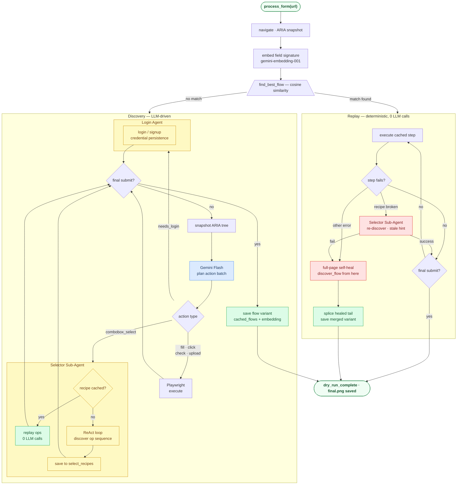

# Form Filler Agent

Autonomous end-to-end job application agent. Drives a real browser via Playwright, reasons over ARIA accessibility trees with Gemini Flash, and fills forms across Greenhouse, Workday, Rippling, iCIMS, and others.

---

---

**Discovery then caching.** The first run is LLM-driven — a ReAct loop snapshots the page, asks Gemini what to do, and executes until the final submit is reached. That transcript is stored as a flow variant. Every subsequent run replays it deterministically with zero LLM calls.

**Specialist agents for complex sub-tasks.** Custom dropdown widgets delegate to a *selector sub-agent* that discovers and caches a literal op-sequence per field (`click_target → click_option → done`). Auth gates hand off to a *login agent* for credentials, account creation, and OTP escalation — keeping both out of the main agent's context.

**RAG-based snapshot matching.** Each flow variant is stored with an embedding of the initial ARIA snapshot. Re-entry retrieves the closest variant by cosine similarity — robust to job-title substitutions in field names, sensitive to genuinely different field sets. The same index drives per-field hint injection inside the selector sub-agent.

**Self-heal based re-discovery.** When replay breaks, field-level repair runs first (one LLM call, surgical). On failure, discovery re-runs from the current page with the failure as context, splices a healed tail onto the already-executed prefix, and saves the merged result.

---

→ [Architecture & design decisions](docs/architecture.md)
→ [Example run — Rippling ATS, full trace](docs/example-run.md)
