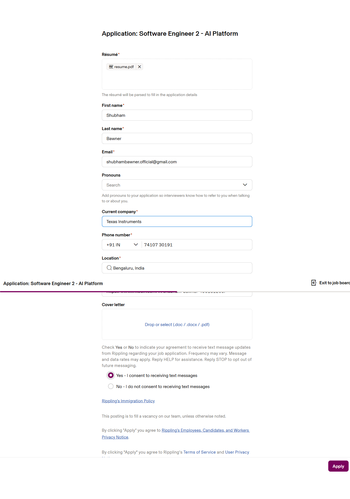

# Example Run — Rippling ATS (Discovery Mode)

A complete trace of a real first-time run against `ats.rippling.com`.  
**2 main-agent iterations · 3 selector-agent steps · 15,527 tokens · dry-run complete in one pass.**

All artifacts are in [`docs/demo/`](demo/).

---

## Execution log

```
[Executor] Force refresh requested for ats.rippling.com#test. Running fresh discovery...
[Agent] Thinking... analyzing current page state
[Browser] Executing upload   on button   'Drop or select (.doc / .docx / .pdf)' [nth=0]
[Browser] Executing fill     on textbox  'First name'      = 'Shubham'
[Browser] Executing fill     on textbox  'Last name'       = 'Bawner'
[Browser] Executing fill     on textbox  'Email'           = 'shubhambawner.official@gmail.com'
[Browser] Executing fill     on textbox  'Current company' = 'Texas Instruments'
[Browser] Executing combobox_select on combobox 'Search'   = '+91'
  → NeedsSelectorAgent raised — handing off to selector sub-agent
[Browser] Executing fill     on textbox  'Phone number'    = '7410730191'
[Browser] Executing fill     on textbox  'Location'        = 'Bengaluru, India'
[Browser] Executing fill     on textbox  'LinkedIn Link'   = 'https://...'
[Browser] Executing click    on radio    'Yes - I consent to receiving text messages'
[Agent] Thinking... analyzing current page state
[DRY RUN] Intercepted final submit: { "action": "click", "role": "button", "name": "Apply" }
```

---

## Iteration 1 — main agent sees blank form

**ARIA snapshot ([`demo/snapshots/iter_01.txt`](demo/snapshots/iter_01.txt)):**
```
- heading "Application: Software Engineer 2 - AI Platform"
- text: Résumé* Total 0 file selected
- button "Drop or select (.doc / .docx / .pdf)"
- textbox "First name"
- textbox "Last name"
- textbox "Email"
- combobox "Pronouns"
- textbox "Current company"
- combobox "Search": +1 US         ← wrong default, needs correcting
- textbox "Phone number"
- textbox "Location"
- textbox "LinkedIn Link"
- button "Drop or select (.doc / .docx / .pdf)"
- radio "Yes - I consent to receiving text messages"
- radio "No - I do not consent to receiving text messages"
- button "Apply" [disabled]
```

**Agent decision ([`demo/llm/iter_01_response.json`](demo/llm/iter_01_response.json)) — 6,402 tokens:**
```json
[
  { "action": "upload",          "role": "button",   "name": "Drop or select (.doc / .docx / .pdf)", "nth": 0, "value": "...resume.pdf" },
  { "action": "fill",            "role": "textbox",  "name": "First name",      "value": "Shubham" },
  { "action": "fill",            "role": "textbox",  "name": "Last name",       "value": "Bawner" },
  { "action": "fill",            "role": "textbox",  "name": "Email",           "value": "shubhambawner.official@gmail.com" },
  { "action": "fill",            "role": "textbox",  "name": "Current company", "value": "Texas Instruments" },
  { "action": "combobox_select", "role": "combobox", "name": "Search",          "value": "+91" },
  { "action": "fill",            "role": "textbox",  "name": "Phone number",    "value": "7410730191" },
  { "action": "fill",            "role": "textbox",  "name": "Location",        "value": "Bengaluru, India" },
  { "action": "fill",            "role": "textbox",  "name": "LinkedIn Link",   "value": "https://www.linkedin.com/in/shubham-bawner-456131205/" },
  { "action": "click",           "role": "radio",    "name": "Yes - I consent to receiving text messages" }
]
```

The `combobox_select` on `"Search"` is a custom widget — `NeedsSelectorAgent` is raised and the selector sub-agent takes over for that one field while the rest of the batch continues.

---

## Selector sub-agent — phone country code combobox (+91)

The `"Search"` combobox is not a native `<select>`. The sub-agent runs its own ReAct loop.

**Step 1 ([`demo/llm/iter_1-1_step_1_response.json`](demo/llm/iter_1-1_step_1_response.json)) — 985 tokens:**
```json
{ "op": "click_target" }
```
Opens the dropdown.

**Step 2 ([`demo/llm/iter_1-1_step_2_response.json`](demo/llm/iter_1-1_step_2_response.json)) — 1,310 tokens:**
```json
{ "op": "click_option", "label": "+91 IN - India" }
```
The local snapshot after `click_target` revealed the option list. Agent clicks the exact label.

**Step 3 ([`demo/llm/iter_1-1_step_3_response.json`](demo/llm/iter_1-1_step_3_response.json)) — 1,181 tokens:**
```json
{
  "op": "done",
  "chosen_label": "+91 IN",
  "description": "Clicked the combobox and selected '+91 IN - India', now displayed as '+91 IN'."
}
```

Verification passes. **Recipe `[click_target, click_option "+91 IN - India"]` is saved to `select_recipes`.** Every future run for this field replays it with zero LLM calls.

---

## Iteration 2 — main agent sees filled form, returns final submit

**ARIA snapshot ([`demo/snapshots/iter_02.txt`](demo/snapshots/iter_02.txt)) — all fields populated:**
```
- status: File resume.pdf uploaded successfully
- textbox "First name": Shubham
- textbox "Last name": Bawner
- textbox "Email": shubhambawner.official@gmail.com
- textbox "Current company": Texas Instruments
- combobox "Search": +91 IN          ← corrected
- textbox "Phone number": 74107 30191
- textbox "Location": Bengaluru, India
- textbox "LinkedIn Link": https://www.linkedin.com/in/shubham-bawner-456131205/
- radio "Yes - I consent to receiving text messages" [checked]
- button "Apply"                      ← now enabled
```

**Agent decision ([`demo/llm/iter_02_response.json`](demo/llm/iter_02_response.json)) — 5,649 tokens:**
```json
[{ "action": "click", "role": "button", "name": "Apply" }]
```

`is_final_submit()` intercepts this lone submit action, takes a screenshot, and returns `dry_run_complete` without clicking. The full transcript is stored as a flow variant keyed to the initial-snapshot embedding.

---

## Final screenshot



---

## Token usage ([`demo/token_usage.json`](demo/token_usage.json))

| Call | Tokens |
|------|--------|
| iter 1 — main agent (blank form → 10 actions) | 6,402 |
| iter 1-1 step 1 — selector agent (`click_target`) | 985 |
| iter 1-1 step 2 — selector agent (`click_option`) | 1,310 |
| iter 1-1 step 3 — selector agent (`done`) | 1,181 |
| iter 2 — main agent (filled form → submit) | 5,649 |
| **Total** | **15,527** |

**Next run against the same form: 0 LLM calls.** The flow variant replays all fills directly; the `+91` recipe replays from `select_recipes`.
